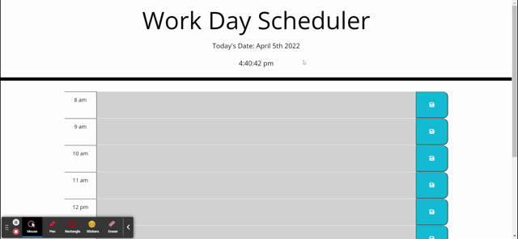

# hw5-workday-scheduler

## Description

This project is a simple app for a workday scheduler, featuring the ability for users to input and save tasks, an updating clock, reloading capabilities, and color differentiation to show how the current hour as well as what blocks are in the past or future.

This could be helpful for anyone wanting to schedule their tasks throughout the day and have it update as they work.

The app builds on HTML and CSS with jQuery and Bootstrap components, allowing for standardized classes and the use of Moment.

## Usage

Deployed application: https://bnicp.github.io/hw5-workday-scheduler/

## Credits

## License

MIT License
